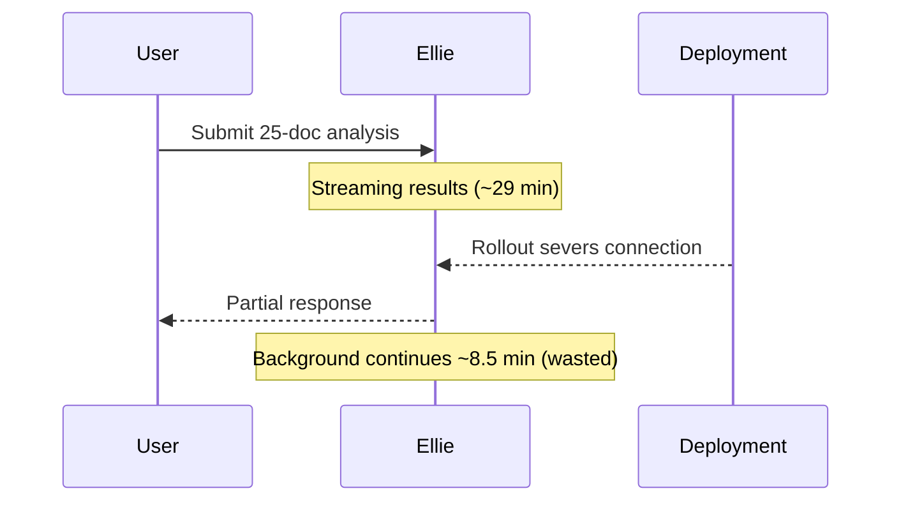

# Problem-Solution Reports

**Purpose**: Document investigation and resolution of bugs, issues, or feature implementations.

**When to Use**:
- Production bugs affecting customers
- Feature development with architectural implications
- Performance issues requiring investigation
- Integration failures or edge cases

**Filename Convention**: `<ticket_number>_<ticket_summary>.md` (e.g., `proj_1234_invoice_rounding_error.md`)

## Formatting Guidelines (All Variants)

### Visual Elements for Clarity

**Use simple visual elements** to make the narrative easier to scan and understand. The purpose of every visual is to aid the target audience's comprehension of the prose — not to decorate, and not to present data the prose does not already tell. If a visual would not genuinely help the target reader, omit it.

**Tables** — inline, no opt-in needed. Use for 3+ items with shared attributes:
| Invoice | Amount | Status |
|---------|--------|--------|
| 6175 | $48.86 | Paid |
| 6426 | $48.86 | Paid |

**ASCII diagrams** — inline, no opt-in needed. Use for simple flows or relationships:
```
Payment → Invoice → Payout
           ↓
      (missing link)
```

**Inline mermaid diagrams** — opt-in via `/report --with-diagram`. Use when a multi-step narrative (sequence of events, permission gating, timeline of failure) would be meaningfully faster to grasp as a visual than as prose. Authored as a fenced `mermaid` block embedded directly in the report body, colocated with the prose it supports:

````markdown

````

**Authoring rule.** Mermaid is the portable authored form (text, diffs cleanly, broadly rendered natively by destination adapters). Terminal formats (PNG, Excalidraw, Figma) are never authored into the report body — `/publish` renders those on demand for adapters that need them.

**When to use:**
- Multiple affected records (invoices, payments, accounts) → **table**
- Counts or statistics broken down by category → **table**
- Simple two-step flows or data relationships → **ASCII**
- Before/after comparisons → **table** or **ASCII**
- Multi-step failure narratives, sequences of events, timeline-shaped stories → **mermaid** (opt-in)

**Keep it simple.** Small tables, basic ASCII, and short mermaid diagrams only. If a diagram needs more than ~10 nodes or edges to convey the story, prose is probably clearer.

**Audience-aware complexity.** Non-technical readers need smaller, more scannable visuals than technical readers. Tighten the node budget and prefer linear shapes:

| Audience | Node budget per diagram | Preferred shape |
|----------|------------------------|-----------------|
| Operational, leadership, mixed | ~5 nodes | Linear `flowchart LR` or `flowchart TD` |
| Junior/mid technical | ~8 nodes | Flowchart or short sequence |
| Senior+ technical | ~10 nodes | Any shape that fits the narrative |

**Prefer multiple small diagrams over one dense diagram for non-technical audiences.** If the story genuinely needs more than the budget, split into one diagram per narrative beat (e.g. "what happened" + "how the fix changes it") rather than compressing everything into a single multi-lane sequence. Parallel participants, crossed arrows, dashed edges, and self-loops are rarely the right choice for operational or leadership readers; a linear flowchart with one or two highlighted nodes almost always communicates the same story faster.

**Drift.** When prose is later edited, update the embedded diagram to match. The local artefact is reviewed before publish, so drift is visible; `/publish` will embed whatever is in the artefact at publish time.

## Collapsible Sections

Sections listed here should be wrapped in `<details>`/`<summary>` at authoring time. The report-builder wraps the section heading as `<summary>` and the section body as the collapsible content. `/publish` handles per-adapter: pass-through for Notion (native toggle) and GitHub, convert to expand macro for Confluence, strip for Slack.

| Variant | Collapsible Sections | Rationale |
|---------|---------------------|-----------|
| Operational | None | Already concise; every section is load-bearing for customer communication |
| Developing Engineers | Suitability, Technical Design | Supplementary to the core problem→cause→solution narrative |
| Principal+ Engineers | Suitability | Main narrative is the value; suitability is optional depth |
| Leadership | None | Already concise; Impact, Next Steps, and Suitability are all load-bearing |

## Common Structure (All Variants)

All problem-solution reports include these core sections:

- **Motivation**: Initial request and how questions evolved
- **The Problem(s)**: Specific issue identification (up to 3 sentences per issue)
- **The Cause**: Root cause analysis (depth varies by audience)
- **The Solution(s)**: Changes implemented, including permissions/configurations
- **Conclusion**: Summary of key points (1-2 paragraphs)

### Status Field

**REQUIRED** in frontmatter. Enum: `shipped` | `revisiting` | `monitoring`. Default: `shipped`.

- **shipped** — resolution deployed to production and considered complete
- **revisiting** — resolution was explored but the approach is being reconsidered (may have been rejected during review, found not fit-for-purpose, or superseded by a broader design question)
- **monitoring** — resolution deployed, watching for recurrence or verifying effectiveness before considering complete

PS reports are written when work reaches a conclusion. Intermediate statuses (`planned`, `investigating`, `hypothesis`, `blocked`) belong to the roundup's curation workflow for issues that only have notes, not reports.

### Ticket Reference Requirement

**CRITICAL**: All problem-solution reports MUST include a link to the issue ticket if the ticket number is known.

**Format**: `Issue Ticket: [PROJ-XXXX](your-issue-tracker-url/PROJ-XXXX)`

**Link Construction**: If you have the ticket number (e.g., `PROJ-1234`), the link can be inferred:
- Pattern: `your-issue-tracker-url/<TICKET_NUMBER>`
- Example: `PROJ-1234` → `your-issue-tracker-url/PROJ-1234`

**Placement**: Include the ticket link at the **beginning of the report, before the Motivation section**.

## Variant 1: Operational Audiences

**Target**: Customer Success, Account Managers, Project Managers
**Length**: 1-1.5 pages
**Tone**: Customer-impact focused, minimal technical detail

**Additional Sections:**
- **The Impact of the Solution(s)** (if applicable):
  - What customers can now do
  - How customer experience improves
- **Next Steps** (if applicable):
  - Follow-up actions needed
  - Related unresolved issues (be brief)

**Cause Section Guidelines:**
- Minimal technical details
- Focus on "what broke" not "how it broke"
- Use accessible analogies when helpful

**Technical Details to Include:**
- Database identifiers: `records.display_id`, `items.display_id`, `accounts.display_name`
- Record GUIDs: `account_id`, `item_id`, etc.
- External IDs: `records.external_id`
- Format as bullet points

**Technical Details to EXCLUDE:**
- Commit hashes, branch names, PR numbers
- File paths and line numbers
- Function names and code snippets
- Test counts and verification workflows
- Git authorship details
- Technical implementation specifics (e.g., "added .trim()")

**Focus on business impact**: "What changed for customers?" not "How was it implemented?"

**Example (Invoice Rounding Issue):**
- **Operational**: "Discount calculation rounding at wrong stage caused penny differences. Fixed to round final total only. Customers now see accurate totals matching payments."

## Variant 2: Developing Engineers

**Target**: Junior/Mid-level Engineers, UI/UX Designers, QA Engineers
**Length**: 1.5-2.5 pages
**Tone**: Educational, pattern-focused, exploration-oriented

**Additional Sections:**
- **Relevant Files and Code**:
  - File paths with line numbers
  - Function names and key variables
  - Small, relevant code snippets illustrating the issue/solution
- **Technical Design and Architecture**:
  - Codebase areas involved (backend services, frontend components, database tables)
  - How systems interact
  - Connection between files, problem, and solution
  - Brief explanations of "how and why" architecture works this way
- **The Suitability of the Technical Solution** (if applicable):
  - Primary solution outlined
  - Quick fix options (e.g., database updates) evaluated first
  - Alternative approaches considered
  - Whether solution addresses root cause
  - If not, what needs to change with code suggestions

**Cause Section Guidelines:**
- Include file paths: `src/services/ExampleService.ts:145`
- Mention function names and flow
- Brief architecture tie-ins (don't overexplain)

**Solution Section Guidelines:**
- Same detail level as Cause section
- Show before/after code patterns when helpful

**Example (Invoice Rounding Issue):**
- Add file paths (`ExampleCalculationService.ts:234`), code snippets (before/after), architecture flow (API → Service → Domain validation)

## Variant 3: Principal+ Engineers

**Target**: Senior/Staff Engineers, Principal Engineers, Architects
**Length**: 2-3 pages (only if warranted by complexity)
**Tone**: Peer-level, assumes deep technical context, focuses on systemic implications

**Additional Sections:**
- **The Suitability of the Technical Solution**:
  - Quick fix options (database updates) evaluated first
  - Edge cases addressed
  - Edge cases NOT addressed
  - Logging & monitoring opportunities
  - Stability/reliability/consistency concerns
  - Impact (business-focused summary in non-technical prose)
- **Technical Design and Architecture**:
  - Systems involved (codebase, database, 3rd party tools)
  - Problem and solution design overview
  - Dependencies requiring improvement or reconsideration

**Cause Section Guidelines:**
- Codebase interactions causing the problem
- High-level design elements
- Low-level mechanisms
- Solution evaluation: Does it address root causes sufficiently?
- If not, outline necessary steps (assume high technical expertise)

**Solution Section Guidelines:**
- Same depth as Cause section
- Focus on architectural implications

**Example (Invoice Rounding Issue):**
- Add design flaw analysis (SRP violation), edge cases addressed/not addressed, stability concerns, decimal-precision recommendation

## Variant 4: Leadership Audiences

**Target**: CTOs, VPs Engineering, Department Heads, cross-functional leadership
**Length**: 1.5-2 pages
**Tone**: Strategic, business-impact focused, high-level technical context

**Additional Sections:**
- **The Impact of the Solution(s)** (if applicable):
  - Customer capabilities enabled
  - Customer experience improvements
- **Next Steps** (if applicable):
  - Follow-up actions
  - Related unresolved issues (brief)
- **The Suitability of the Technical Solution**:
  - Quick fixes (e.g., database updates) mentioned first
  - Stability/reliability/consistency concerns
  - Edge cases addressed
  - Edge cases NOT addressed

**Cause Section Guidelines:**
- High-level technical details without file paths or table names
- Focus on design and impact from senior engineering perspective
- Accessible to non-technical leadership

**Example (Invoice Rounding Issue):**
- High-level cause, business impact (30% fewer support tickets, 2-3 hrs/week savings), strategic recommendation (decimal library initiative)

## Modifiers

See `agentic://reports/modifiers.md` for all modifier definitions (`condensed`, `diff-only`, `no-code`) and their transforms for this report type.
